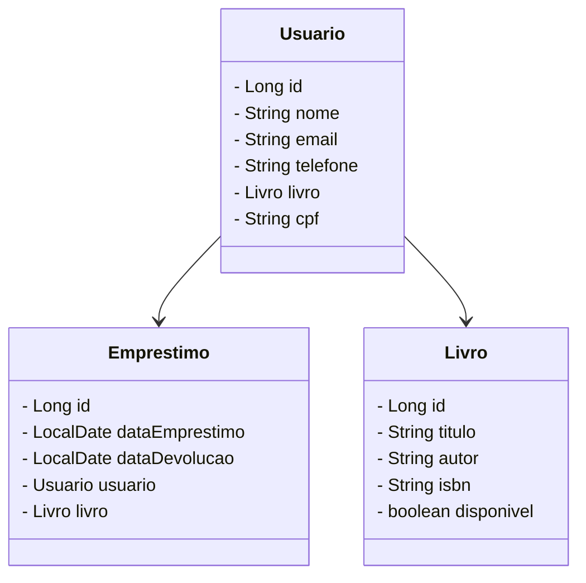

# Projeto Biblioteca com Spring Boot

Este projeto em Java que é uma aplicação de biblioteca que permite o cadastro de leitores, livros e o gerenciamento de empréstimos. A aplicação foi desenvolvida utilizando o framework Spring Boot e segue as boas práticas de desenvolvimento. 
O swagger foi utilizado para documentar o projeto e para colocar o projeto na nuvem foi utlizado a plataforma railway.

## Funcionalidades

- **Cadastro de Leitores:**
  - Adicionar, listar, buscar por ID e deletar leitores.

- **Cadastro de Livros:**
  - Adicionar, listar, buscar por ID e deletar livros.

- **Gerenciamento de Empréstimos:**
  - Realizar, listar, buscar por ID e deletar empréstimos.
  - Verificar disponibilidade de livros antes de realizar um empréstimo.
  - Atualizar a disponibilidade de livros ao realizar ou deletar um empréstimo.

### Diagrama de Classes

