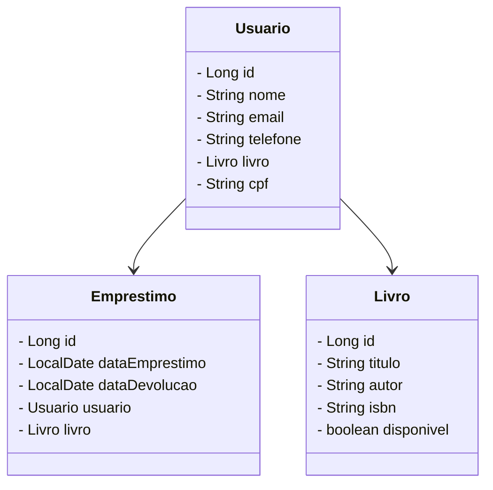

# Projeto Biblioteca com Spring Boot 📚

Este projeto em Java que é uma aplicação de biblioteca que permite o cadastro de leitores, livros e o gerenciamento de empréstimos.

### Funcionalidades 💻

- **Cadastro de Leitores:**
  - Adicionar, listar, buscar por ID e deletar leitores.

- **Cadastro de Livros:**
  - Adicionar, listar, buscar por ID e deletar livros.

- **Gerenciamento de Empréstimos:**
  - Realizar, listar, buscar por ID e deletar empréstimos.
  - Verificar disponibilidade de livros antes de realizar um empréstimo.
  - Atualizar a disponibilidade de livros ao realizar ou deletar um empréstimo.
    

### Tecnologias Utilizadas 🔎

- **Spring Boot 3**: Framework que permite a criação de aplicações Java de forma simplificada e com autoconfiguração.
- **Spring Data JPA**: Facilita a interação com bancos de dados SQL, proporcionando uma camada de abstração para as operações de CRUD.
- **OpenAPI (Swagger)**: Ferramenta para documentação de APIs, tornando-as mais compreensíveis e acessíveis.
- **Railway**: Plataforma para deploy de aplicações na nuvem, simplificando a entrega contínua.

### Configuração do Projeto

### Banco de Dados

Este projeto utiliza PostgreSQL.

### Diagrama de Classes

